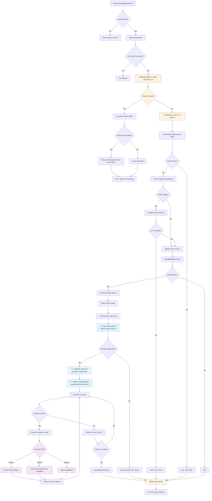
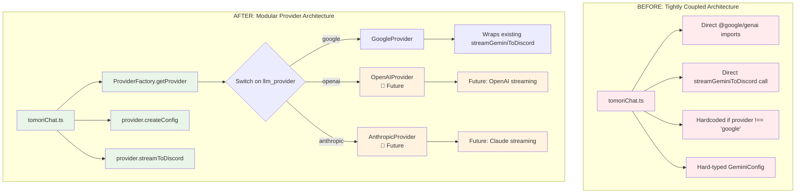

# TomoriBot LLM Provider Abstraction Refactor

## Overview
This document tracks the progress of refactoring TomoriBot from a tightly-coupled Gemini implementation to a modular provider architecture that supports multiple LLM providers.

## Completed Tasks ✅

### Phase 1: Provider Abstraction Layer
- ✅ **Created base provider interface** (`src/providers/base/Provider.ts`)
  - Defined `LLMProvider` interface with common methods
  - Created `ProviderConfig`, `StreamResult`, `ProviderInfo` types
  - Implemented `BaseLLMProvider` abstract class
  - Methods: `validateApiKey()`, `streamToDiscord()`, `getTools()`, `createConfig()`

- ✅ **Created provider factory** (`src/providers/ProviderFactory.ts`)
  - Implemented `ProviderFactory` class with singleton pattern
  - Switch statement based on `llm_provider` configuration
  - Support for Google (implemented), OpenAI/Anthropic (planned)
  - Graceful error handling for unsupported providers

### Phase 2: Google Provider Implementation
- ✅ **Refactored Google provider** (`src/providers/google/GoogleProvider.ts`)
  - Implemented `LLMProvider` interface for Google Gemini
  - Extended `GoogleProviderConfig` with Gemini-specific settings
  - Wrapped existing `streamGeminiToDiscord` function
  - Maintained backward compatibility with existing functionality
  - Provider info: supports streaming, function calling, images, videos

### Phase 3: Main Application Updates
- ✅ **Refactored tomoriChat.ts** (`src/events/messageCreate/tomoriChat.ts`)
  - Removed direct Google/Gemini imports
  - Replaced hardcoded provider check with `getProviderForTomori()`
  - Updated streaming calls to use provider interface
  - Converted provider-specific types to generic types
  - Maintained all existing functionality while decoupling from Gemini

## Current Architecture

### Provider Structure
```
src/providers/
├── base/
│   └── Provider.ts          # Base interface and abstract class
├── google/
│   ├── GoogleProvider.ts    # Google implementation
│   ├── gemini.ts           # Original Gemini functions (wrapped)
│   ├── functionCalls.ts    # Google-specific function declarations
│   └── subAgents.ts        # Google-specific sub-agents
└── ProviderFactory.ts       # Provider factory and management
```

### Key Benefits Achieved
1. **Decoupled Architecture**: Main application code no longer directly imports provider-specific modules
2. **Provider Agnostic**: Easy to add new LLM providers (OpenAI, Anthropic, etc.)
3. **Backward Compatibility**: All existing Gemini functionality preserved
4. **Clean Interfaces**: Type-safe provider switching with proper error handling
5. **Extensible**: Framework ready for additional provider features

## Recently Fixed 🔧

- ✅ **Fixed all linting errors** in refactored files
  - Added proper TypeScript types to replace `any` usage
  - Fixed non-null assertions and implicit any issues
  - Converted ProviderFactory from class to namespace (more appropriate)
  - Build now passes without errors

## In Progress Tasks 🚧

- 🚧 **Update setup.ts** to use provider factory for API key validation
- ⏳ **Update apikeyset.ts** to use provider factory  
- ⏳ **Update model.ts** to make model choices dynamic based on provider
- ⏳ **Check contextBuilder.ts** for any provider-specific references

## Pending Tasks ⏳

### Phase 4: Configuration Updates
- ⏳ Update database configuration for dynamic model choices
- ⏳ Make LLM model lists provider-aware instead of hardcoded

### Phase 5: Testing & Validation  
- ⏳ Test basic chat functionality with Google provider
- ⏳ Test function calling (stickers, search, self-teach)
- ⏳ Test streaming behavior
- ⏳ Validate error handling
- ⏳ Test API key validation through provider

## Files Modified

### New Files Created
- `src/providers/base/Provider.ts` - Provider interface definition
- `src/providers/ProviderFactory.ts` - Provider factory implementation  
- `src/providers/google/GoogleProvider.ts` - Google provider implementation

### Modified Files
- `src/events/messageCreate/tomoriChat.ts` - Main chat handler refactored
  - Removed direct Gemini imports
  - Added provider factory usage
  - Updated function call handling
  - Converted provider-specific types

### Files Pending Updates
- `src/commands/config/setup.ts` - API key validation
- `src/commands/config/apikeyset.ts` - API key validation
- `src/commands/config/model.ts` - Dynamic model choices
- `src/utils/text/contextBuilder.ts` - Check for provider references

## Testing Strategy

Before continuing with remaining tasks, we should test:

1. **Basic Chat Functionality**
   - Start TomoriBot and test basic chat responses
   - Verify streaming still works properly
   - Check that provider selection works correctly

2. **Function Calling**
   - Test sticker selection function
   - Test Google search function  
   - Test self-teaching memory function

3. **Error Handling**
   - Test with invalid provider configuration
   - Test provider factory error cases
   - Verify graceful degradation

## Next Steps

1. **Immediate Testing**: Test current refactored chat functionality
2. **Complete Remaining Files**: Update setup.ts, apikeyset.ts, model.ts
3. **Dynamic Configuration**: Make model choices provider-aware
4. **Future Providers**: Add OpenAI/Anthropic when ready

## TomoriChat Flow Architecture

### Complete Flow Diagram



### Architectural Change: Before vs After



### Key Process Phases

#### Phase 1: Discord & Security Layer (Steps 1-11)
**Provider Agnostic - No Changes Needed**
- Message validation and permissions
- Channel locking/semaphore system
- User authentication and rate limiting
- Context building and message history

#### Phase 2: LLM Provider Layer (Step 12+) 
**🎯 This is where our refactoring transformed the architecture**

**BEFORE:**
```typescript
// Hard-coded provider check
if (tomoriState.llm_provider !== "google") return;

// Direct Gemini configuration
const geminiConfig: GeminiConfig = { /* hardcoded */ };

// Direct function call
await streamGeminiToDiscord(config, ...);
```

**AFTER:**
```typescript
// Dynamic provider selection
const provider = getProviderForTomori(tomoriState);

// Provider-agnostic configuration
const config = provider.createConfig(tomoriState, apiKey);

// Interface-based streaming
const result = await provider.streamToDiscord(config, ...);
```

#### Phase 3: Function Execution Layer
**Abstracted but Provider-Aware**
- Function calls (stickers, search, memory) are executed locally
- Results are passed back to the provider in their expected format
- Provider handles the LLM communication details

### Critical Modularity Boundary

**Line 770-774 in tomoriChat.ts is the exact point where modularity begins:**

```typescript
// 12. Generate Response - Get provider instance
// Get the appropriate provider based on TomoriState configuration  
let provider: LLMProvider;
try {
    provider = getProviderForTomori(tomoriState);  // 🎯 MODULARITY STARTS HERE
```

**Everything before this line:** Provider-agnostic application logic
**Everything after this line:** Uses provider interface methods

## Notes

- All existing Gemini functionality has been preserved through the GoogleProvider wrapper
- Provider factory uses singleton pattern for efficiency  
- Error handling includes proper logging with context
- Type safety maintained throughout the refactor
- **The semaphore system ensures only one message processes per channel at a time**
- **Function calling happens locally, with results fed back to the provider**
- Ready for immediate testing of core chat functionality