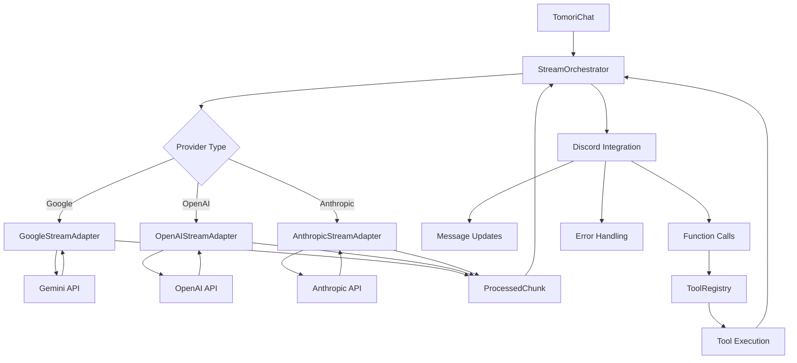

# Streaming Modularization Plan

## Executive Summary

This document outlines the plan to modularize TomoriBot's streaming architecture, extracting ~600 lines of universal Discord logic from the Google-specific `streamGeminiToDiscord` function into a reusable `StreamOrchestrator` that can work with any LLM provider.

## Current State Analysis

### Current Architecture
```
streamGeminiToDiscord() - 800+ lines
├── Google-Specific Logic (~200 lines)
│   ├── Gemini API configuration
│   ├── Part/chunk processing
│   └── Google error handling
└── Universal Discord Logic (~600 lines)
    ├── Message creation/editing
    ├── Embed handling
    ├── Function call routing
    ├── Timeout management
    └── Error recovery
```

### Problems with Current Approach
1. **Massive code duplication** - Each new provider will copy 600+ lines of Discord logic
2. **Inconsistent behavior** - Different providers might handle timeouts/errors differently
3. **Testing complexity** - Discord integration logic must be tested for each provider
4. **Maintenance burden** - Bug fixes need to be applied to multiple files

## Proposed Modular Architecture

### Core Components

#### 1. Stream Provider Interface
```typescript
interface StreamProvider {
    // Start the streaming process
    startStream(config: ProviderConfig): AsyncGenerator<StreamChunk>
    
    // Process raw provider chunks into normalized format
    processChunk(chunk: unknown): ProcessedChunk
    
    // Extract function calls from chunks
    extractFunctionCall(chunk: unknown): FunctionCall | null
    
    // Handle provider-specific errors
    handleProviderError(error: unknown): ProviderError
}
```

#### 2. Stream Orchestrator (Universal Discord Logic)
```typescript
class StreamOrchestrator {
    async streamToDiscord(
        provider: StreamProvider,
        config: StreamConfig,
        context: StreamContext
    ): Promise<StreamResult>
}
```

#### 3. Provider Stream Adapters
```typescript
class GoogleStreamAdapter implements StreamProvider { /* ~200 lines */ }
class OpenAIStreamAdapter implements StreamProvider { /* ~150 lines */ }
class AnthropicStreamAdapter implements StreamProvider { /* ~180 lines */ }
```

### Data Flow Architecture



## Implementation Phases

### Phase 1: Interface Design & Core Types
**Goal**: Define the streaming interfaces and common types
**Files**: 
- `src/streaming/interfaces.ts` - Stream provider interface and types
- `src/streaming/types.ts` - Common chunk, error, and config types

**Deliverables**:
```typescript
// Normalized chunk format that all providers convert to
interface ProcessedChunk {
    type: 'text' | 'function_call' | 'error' | 'done'
    content?: string
    functionCall?: FunctionCall
    error?: ProviderError
    metadata?: Record<string, unknown>
}

// Universal streaming configuration
interface StreamConfig {
    provider: string
    apiKey: string
    model: string
    context: StreamContext
    options: StreamOptions
}
```

### Phase 2: Extract Universal Discord Logic
**Goal**: Create `StreamOrchestrator` with all Discord integration logic
**Files**: 
- `src/streaming/StreamOrchestrator.ts` - Universal Discord streaming logic (~600 lines)

**Key Responsibilities**:
- Discord message creation and editing
- Embed generation and updates
- Function call routing to ToolRegistry
- Stream timeout management
- Error recovery and user notifications
- Message chunking and rate limiting

### Phase 3: Create Google Stream Adapter
**Goal**: Extract Google-specific logic into adapter implementing `StreamProvider`
**Files**:
- `src/streaming/adapters/GoogleStreamAdapter.ts` - Google-specific streaming (~200 lines)

**Key Responsibilities**:
- Gemini API client management
- Google Part/chunk processing
- Google-specific error handling
- Function call extraction from Google format

### Phase 4: Refactor Current Implementation
**Goal**: Replace `streamGeminiToDiscord` with orchestrator + adapter
**Files Modified**:
- `src/providers/google/GoogleProvider.ts` - Use orchestrator
- `src/providers/google/gemini.ts` - Remove or simplify existing function

**Result**: `streamGeminiToDiscord` function reduced from 800 lines to ~50 lines

### Phase 5: OpenAI & Anthropic Adapters
**Goal**: Demonstrate modularity by implementing additional providers
**Files**:
- `src/streaming/adapters/OpenAIStreamAdapter.ts` - OpenAI streaming (~150 lines)
- `src/streaming/adapters/AnthropicStreamAdapter.ts` - Anthropic streaming (~180 lines)

### Phase 6: Testing & Validation
**Goal**: Comprehensive testing of modular streaming system
**Files**:
- `tests/streaming/` - Unit tests for orchestrator and adapters
- Integration tests with actual provider APIs

## Benefits Analysis

### Code Reuse
- **Current**: Each provider = 800+ lines of streaming logic
- **After**: Each provider = 150-200 lines + shared 600-line orchestrator
- **Savings**: 75% reduction in streaming code per provider

### Consistency
- Universal timeout handling (currently 30-60 seconds in Gemini)
- Standardized error messages and recovery
- Consistent Discord message formatting
- Uniform function call routing

### Maintainability  
- Bug fixes apply to all providers automatically
- New Discord features (embeds, buttons, etc.) work everywhere
- Centralized rate limiting and message chunking
- Single source of truth for streaming behavior

### Development Speed
- Adding OpenAI streaming: ~150 lines vs ~800 lines (81% faster)
- Adding Anthropic streaming: ~180 lines vs ~800 lines (77% faster)
- New Discord integration features work across all providers

## Risk Assessment

### Technical Risks
- **Complexity**: New abstraction layer adds complexity
- **Performance**: Extra abstraction might add latency (minimal impact expected)
- **Edge cases**: Provider-specific quirks might not fit interface

### Mitigation Strategies
- Gradual migration starting with Google (existing working implementation)
- Comprehensive testing at each phase
- Interface flexibility for provider-specific extensions
- Fallback to original implementation if issues arise

## Success Metrics

1. **Code Reduction**: 75%+ reduction in streaming code per new provider
2. **Feature Parity**: All current Google streaming features work identically
3. **Performance**: <5% latency increase in streaming response time
4. **Reliability**: Same or better error handling and recovery
5. **Development Speed**: 50%+ faster to add new streaming providers

## Next Steps

1. Review and approve this plan
2. Begin Phase 1: Interface design
3. Set up development branch for streaming refactor
4. Create initial interfaces and types
5. Begin extracting orchestrator logic

---

*This plan prioritizes streaming modularization as requested, putting the provider factory work on hold until streaming architecture is complete.*