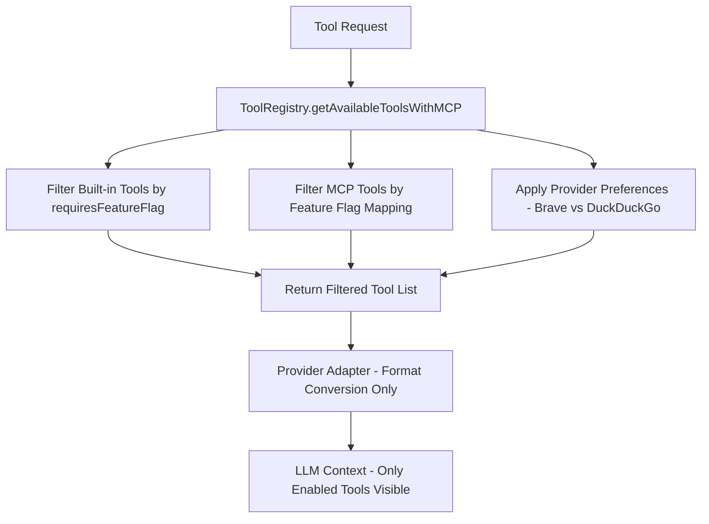

# Tool System

TomoriBot's **modular tool system** provides a unified way to extend functionality across all LLM providers. Tools can be built-in function calls or external MCP (Model Context Protocol) servers, all managed through a central registry with automatic discovery and execution.

## Tool Architecture Overview

### Core Components

- **ToolRegistry** - Central registry and execution engine
- **ToolInitializer** - Automatic tool discovery and registration
- **Provider Adapters** - Convert tools to provider-specific formats
- **MCP Integration** - External server support with behavior handlers

### Tool Interface

All tools implement the same base interface:

```typescript
interface Tool {
    name: string;
    description: string;
    category: ToolCategory;
    parameters: ToolParameterSchema;
    
    // Execution
    execute(args: Record<string, unknown>, context: ToolContext): Promise<ToolResult>;
    
    // Provider compatibility
    isAvailableFor(provider: string): boolean;
    
    // Optional enhancements
    requiresPermissions?: string[];
    requiresFeatureFlag?: string;
}
```

## Built-in Function Call Tools

Built-in tools extend the `BaseTool` class and are automatically discovered via file system scanning. TomoriBot supports two patterns for built-in tools:

### 1. Simple Built-in Tools
Traditional single-file tools for straightforward functionality.

### 2. REST API Tools  
Modular tools for external APIs requiring complex processing, server-specific API keys, and rich data flow.

### Creating a Built-in Tool

1. **Create tool implementation**:

```typescript
// src/tools/functionCalls/yourTool.ts
export class YourTool extends BaseTool {
    name = "your_tool_name";
    description = "What your tool does";
    category = "utility" as const;
    
    parameters: ToolParameterSchema = {
        type: "object",
        properties: {
            param1: { type: "string", description: "Parameter description" }
        },
        required: ["param1"]
    };
    
    async execute(args: Record<string, unknown>, context: ToolContext): Promise<ToolResult> {
        // Your tool logic here
        return { success: true, data: { status: "completed" } };
    }
}
```

2. **Export in index**:

```typescript
// src/tools/functionCalls/index.ts
export { YourTool } from "./yourTool";
```

3. **Automatic integration**: The system automatically:
   - Discovers your tool via dynamic imports
   - Converts your schema to provider-specific formats
   - Handles execution through the registry
   - Manages permissions and feature flags

### Current Built-in Tools

**StickerTool** (`stickerTool.ts`)
- Discord sticker selection and sending
- Integrates with server sticker collections
- Context-aware availability based on permissions

**MemoryTool** (`memoryTool.ts`)
- Learning and memory storage (personal and server-wide)
- Encrypted storage with PostgreSQL
- Contextual memory retrieval and management

**YouTubeVideoTool** (`youTubeVideoTool.ts`)
- YouTube video processing using Google's video understanding
- Context-aware availability to prevent hallucination
- Enhanced context restart with video Parts injection

## REST API Tool Pattern

For external APIs requiring complex processing, TomoriBot provides an **REST API Tool pattern** that offers superior architecture for external integrations.

### Architecture Benefits

**🏗️ Modular Structure**: Clean separation of concerns across multiple files
**🔑 Server-Specific API Keys**: Per-guild API key management with encryption  
**📊 Rich Data Flow**: MCP-compatible data structures flow end-to-end to LLM
**🛡️ Enhanced Error Handling**: User-friendly Discord embeds with localization
**⚡ Easy Replication**: Template structure for any external API integration

### File Structure Pattern

```
src/tools/restAPIs/[service]/
├── types.ts              # API response interfaces
├── [service]Service.ts   # Core HTTP service functions
├── toolImplementations.ts # MCP-compatible function implementations  
├── tools.ts              # BaseTool extensions for tool registry
└── index.ts              # Clean exports
```

### Key Implementation Details

**Data Flow Architecture:**
```typescript
// 1. Service Layer - REST API calls
export async function serviceApiCall(params, config): Promise<ApiResult> {
  const apiKey = await getOptApiKey(config.serverId, "service-name") || process.env.API_KEY;
  // API implementation
}

// 2. Implementation Layer - MCP-compatible functions
export async function service_function(args, context): Promise<{
  success: boolean; 
  message: string; 
  data?: unknown;  // ← Rich data structure
  error?: string;
}> {
  return {
    success: true,
    message: "Operation completed",
    data: {
      // MCP-compatible structure for LLM processing
      source: "http",
      functionName: "service_function",
      rawResult: { content: [...] },
      executionTime: 1234,
      status: "completed"
    }
  };
}

// 3. Tool Class Layer - Registry integration
export class ServiceTool extends BaseTool {
  protected convertToToolResult(result: {
    success: boolean;
    message: string;
    data?: unknown;  // ← Critical: Preserve rich data
    error?: string;
  }): ToolResult {
    const toolResult: ToolResult = { success: result.success, message: result.message };
    
    if (result.data) {
      toolResult.data = result.data; // ← Ensures data flows to LLM
    }
    
    return toolResult;
  }
}
```

**Error Handling with User-Friendly Embeds:**
```typescript
// API key validation with Discord embed
if (isBraveApiKeyError(result.error, result.statusCode)) {
  await sendStandardEmbed(context.channel, context.locale, {
    titleKey: "errors.api.missing_key.title",
    descriptionKey: "errors.api.missing_key.description", 
    descriptionVars: { service: "ServiceName" },
    color: ColorCode.ERROR,
  });
  return createToolResult(false, "API key required", result.error);
}
```

### Current REST API Tools

**✅ Brave Search Tools** (`src/tools/restAPIs/brave/`)
- Complete implementation of Web, Image, Video, News search
- Server-specific API key management with environment fallback
- Discord image attachment processing and agentic fetch reminders
- Parameter override system and token optimization
- **Functions**: `brave_web_search`, `brave_image_search`, `brave_video_search`, `brave_news_search`

### REST API vs MCP Comparison

| Feature | REST API Tools | MCP Tools |
|---------|---------------|-----------|
| **Implementation** | Direct HTTP calls | External server processes |
| **API Key Management** | Per-server encrypted storage | Environment variables only |
| **Data Processing** | Full control & customization | Limited to server capabilities |
| **Error Handling** | Rich Discord embeds | Basic error messages |
| **Performance** | Direct API calls | Process communication overhead |
| **Maintenance** | Internal codebase control | External dependency updates |

**When to Choose REST API Tools:**
- Need server-specific API key management
- Require custom data processing or parameter overrides  
- Want rich Discord integration (embeds, attachments)
- Need fine-grained error handling and user feedback
- API has complex response structures requiring transformation

**When to Choose MCP Tools:**
- Standard API integration without customization
- External server already available and maintained
- Simple pass-through functionality
- Rapid prototyping or temporary integrations

## MCP Server Integration

**Model Context Protocol (MCP)** integration is **completely finalized** with provider-agnostic architecture, full type safety, and zero technical debt!

### MCP Architecture Components

**1. Modular MCP System** - Complete provider-agnostic architecture:
- **MCP Manager** (`src/utils/mcp/mcpManager.ts`) - Server lifecycle management
- **MCP Executor** (`src/utils/mcp/mcpExecutor.ts`) - Universal function execution with behavior handler registry
- **MCP Config Manager** (`src/utils/mcp/mcpConfig.ts`) - JSON configuration loading and validation
- **MCP Type Definitions** (`src/types/tool/mcpTypes.ts`) - Comprehensive TypeScript interfaces (zero `any` types)

**2. Server-Specific Behavior Handlers** - Dedicated logic per MCP server:
- **Brave Search Handler** - Image auto-sending, parameter overrides, web search enhancements
- **Fetch Handler** - URL content processing and markdown conversion
- **DuckDuckGo Handler** - Future free web search (scaffolded)

### MCP Server Configuration

Each MCP server has a configuration file defining its behavior:

```json
// src/tools/mcpServers/brave-search/config.json
{
  "name": "brave-search",
  "displayName": "Brave Search",
  "npmPackage": "@brave/brave-search-mcp-server",
  "description": "Premium web search with image/video/news search",
  "requiredEnvVars": ["BRAVE_API_KEY"],
  "category": "search",
  "transport": "stdio",
  "enabled": true
}
```

### Database Integration

Encrypted API key storage per guild:

```sql
CREATE TABLE mcp_api_keys (
  mcp_api_key_id SERIAL PRIMARY KEY,
  server_id INT NOT NULL,
  mcp_name TEXT NOT NULL,
  api_key BYTEA,  -- Encrypted using pgcrypto
  UNIQUE (server_id, mcp_name)
);
```

### Available MCP Servers

**✅ Brave Search MCP** (Production-Ready)
- Premium web search with automatic image sending to Discord
- Functions: `brave_web_search`, `brave_image_search`, `brave_video_search`, `brave_news_search`, `brave_local_search`, `brave_summarizer`
- Enhanced with fetch capability reminders

**✅ Fetch MCP** (Production-Ready)
- URL content retrieval and markdown conversion
- Function: `fetch` with content length optimization
- Automatic HTML-to-markdown conversion

**🔄 DuckDuckGo Search MCP** (Ready for Integration)
- Free web search alternative
- Handler scaffolded, awaiting server availability

## Tool Registry System

### Centralized Feature Flag Architecture

TomoriBot implements a **centralized feature flag system** that ensures consistent tool filtering across all providers (Google, OpenAI, Anthropic) with zero code duplication.

#### Core Architecture Components

**1. Centralized Feature Flag Mapper** (`src/utils/tools/featureFlagMapper.ts`)
- **Single source of truth** for all tool → feature flag mappings
- **Built-in tools** filtered via `requiresFeatureFlag` property
- **MCP tools** filtered via centralized function name mapping
- **Provider-agnostic** - works identically across all LLM providers

```typescript
// Built-in tools (automatically filtered)
export const BUILTIN_TOOL_FEATURE_FLAGS: Record<string, string> = {
  select_sticker_for_response: "sticker_usage",
  remember_this_fact: "self_teaching",
  brave_web_search: "web_search",
  // Add new tools here
};

// MCP tools (centrally managed)
export const MCP_TOOL_FEATURE_FLAGS: Record<string, string> = {
  "web-search": "web_search",
  "felo-search": "web_search", 
  "fetch-url": "web_search",
  // Add new MCP functions here
};
```

**2. Enhanced ToolRegistry** (`src/tools/toolRegistry.ts`)
- **`getAvailableToolsWithMCP()`** - New centralized method that filters both built-in AND MCP tools
- **Unified filtering logic** - Feature flags + provider preferences (Brave vs DuckDuckGo)
- **Extensible architecture** - Future providers automatically inherit the same filtering

```typescript
// Centralized filtering for both built-in and MCP tools
const { builtInTools, mcpFunctionNames, totalCount } = await getAvailableToolsWithMCP(
  provider, 
  stateForContext
);
// Returns only tools that pass feature flag filtering
```

#### Tool Filtering Pipeline



**Key Benefits:**
- **✅ Zero Provider Duplication**: Add one tool → works across all providers
- **✅ Consistent Behavior**: Same filtering logic everywhere
- **✅ Easy Extension**: Add new providers without code changes
- **✅ Centralized Management**: Single file to manage all feature flags

### Unified Execution

All tools execute through the same interface:

```typescript
// MCP tools and built-in tools use identical execution
const result = await ToolRegistry.executeTool(toolName, args, context);
```

### Provider Integration

**Updated Provider Architecture** - Providers now use centralized filtering:

```typescript
// OLD: Provider-specific filtering (Google only)
const availableTools = ToolRegistry.getAvailableTools(providerName, context);
const providerTools = await toolAdapter.getAllToolsInProviderFormat(availableTools);

// NEW: Centralized filtering (all providers)
const { builtInTools, mcpFunctionNames } = await getAvailableToolsWithMCP(provider, stateForContext);
const providerTools = await toolAdapter.getAllToolsInProviderFormat(builtInTools, serverId, mcpFunctionNames);
```

**For New Provider Implementations:**
```typescript
// Any new provider (OpenAI, Anthropic) gets filtering automatically
export class NewProviderAdapter implements MCPCapableToolAdapter {
  async getAllToolsInProviderFormat(builtInTools, serverId, allowedMCPFunctions) {
    // 1. Convert built-in tools to provider format (already filtered)
    // 2. Include only MCP functions from allowedMCPFunctions (already filtered)
    // 3. No filtering logic needed - it's all centralized!
  }
}
```

### Permission and Feature Flag Management

**Built-in Tools** - Use `requiresFeatureFlag` property:
```typescript
export class AdminTool extends BaseTool {
    requiresPermissions = ["ADMINISTRATOR"];
    requiresFeatureFlag = "advanced_admin_tools"; // ← Automatically filtered
    
    // Tool automatically filtered by ToolRegistry before reaching LLM
}
```

**MCP Tools** - Add to centralized mapping:
```typescript
// src/utils/tools/featureFlagMapper.ts
export const MCP_TOOL_FEATURE_FLAGS: Record<string, string> = {
  "admin_command": "advanced_admin_tools", // ← Add MCP function here
  // Automatically filtered by getAvailableToolsWithMCP()
};
```

### Adding New Feature Flags

When creating new feature categories:

1. **Add to TomoriConfig interface** (`src/types/db/schema.ts`)
2. **Update feature flag converter** (`src/utils/tools/featureFlagMapper.ts`)
3. **Add database column** (`src/db/schema.sql`)

The centralized system automatically handles the rest!

## Tool Execution Context

Tools receive rich context for execution:

```typescript
interface ToolContext {
    // Discord context
    channel: BaseGuildTextChannel;
    client: Client;
    message?: Message;
    
    // Tomori context
    tomoriState: TomoriState;
    locale: string;
    
    // Provider context
    provider: string;
    
    // Optional streaming context for advanced features
    streamContext?: StreamingContext;
}
```

## Key Architecture Benefits

**🔄 Single Entry Point**: All tool execution flows through `ToolRegistry.executeTool()`

**🎯 Provider Agnostic**: Same tools work with Google, OpenAI, Anthropic providers

**⚡ Modular Extension**: Tools can be added/removed without changing core logic

**🛡️ Comprehensive Security**: Permission checking, feature flags, and validation

**📊 Consistent Behavior**: Universal error handling, logging, and Discord integration

**🚀 MCP Integration**: External servers work identically to built-in tools

**🏗️ Centralized Feature Flag System**: New TomoriBot architectural highlight

- **Zero Code Duplication**: Feature flag logic centralized in one place
- **Provider Extensibility**: New providers inherit filtering automatically  
- **Unified Management**: Both built-in and MCP tools filtered consistently
- **Easy Maintenance**: Add new tools/flags without touching provider code

## Migration Notes for Contributors

**⚠️ Important for New Provider Development**:

The tool system now uses **centralized filtering**. When implementing new providers:

```typescript
// ✅ CORRECT: Use centralized filtering
const { builtInTools, mcpFunctionNames } = await getAvailableToolsWithMCP(provider, stateForContext);
const tools = await adapter.getAllToolsInProviderFormat(builtInTools, serverId, mcpFunctionNames);

// ❌ INCORRECT: Don't implement your own filtering
const allTools = ToolRegistry.getAllTools(); // Missing feature flag filtering!
const tools = await adapter.convertTools(allTools); // Will show disabled tools!
```

**For Existing Implementations**: Google provider has been updated to use the new system. Future OpenAI/Anthropic providers should follow the same pattern.

---

**Next**: Learn about [Context-Aware Tools](05-context-aware-tools.md) and advanced dynamic tool management.